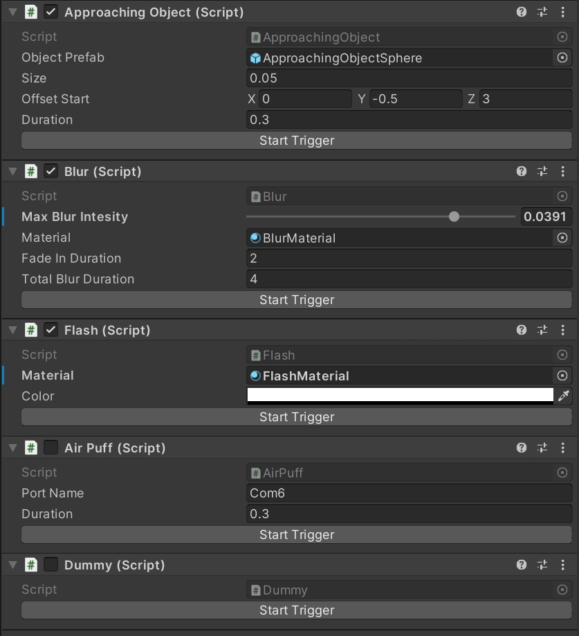

# VR-Blink-Trigger

VR-Blink-Trigger provides a set of Unity scripts that implement different ways to trigger an eye blink in Virtual Reality:

- **Flash:** A blink is induced by a short, bright light (also referred to as dazzle reflex). In Unity, the Flash is implemented by a white screen that appears for only one frame.
- **Blur:**  The screen gradually blurs, which should resemble the view of lost focus and thereby evoke a blink by the user to clear the view. 
- **Approaching Object:** Blinking is triggered by an unexpected object coming towards the user (also referred to as menace reflex). In Unity, the approaching object is implemented by a black sphere that is rapidly approaching the camera.
- **AirPuff:** By blowing a small puff of air towards an area around the eye, the cornea reflex is stimulated and results in an eye blink. The air puff can be produced by a small piezoelectric microblower.

**Flash, Blur and ApproachingObject** are **visual** blink trigger. They were implemented only by software and can be used right away.  
In order to use the **Air Puff**, you have to build and integrate a microblower into the VR glasses. You can find instructions below.

## Requirements
`Unity (>= 2020.3.6f1)`

## Installation
Download **vr-blink-trigger.unitypackage** and import the files into your project. 

## Setup and Usage
You can either run the ` ExampleBlinkTrigger ` Scene, which contains a demo room setup and the **TriggerManager**, or you can drag the **Trigger Manager** from the Prefabs folder into your scene.

### Trigger Manager
The Blink Trigger Scripts **Flash**, **Blur**, **ApproachingObject**, **AirPuff** and **Dummy** are components of the **Trigger Manager**. 
The **Trigger Manager** also contains an enum for each of the Blink Trigger:  
`public enum TriggerType { FlashTrigger, BlurTrigger, AirPuffTrigger, ApproachingObjectTrigger, DummyTrigger}`

The **Trigger Manager** can be used as an interface and has the following methods:  
- `SetTrigger(TriggerType trigger)` : Set the trigger for the next run (optional).

- `StartTrigger()` : Start the trigger that was set by the method SetTrigger(TriggerType trigger)  
**or** `StartTrigger(TriggerType trigger)` : Start the trigger that is given as parameter.

- `StopTrigger()` : Stop the trigger that was set by the method SetTrigger(TriggerType trigger)  
**or** `StopTrigger(TriggerType trigger)` : Stop the trigger that is given as parameter.

The Trigger Manager also provides two **UnityEvents**: `OnTriggerStart` and `OnTriggerEnd`, which will be called at the start/end of a trigger.

### Blink Trigger Parameter
The parameters of the Blink Trigger Scripts can be modified in the inspector. If you want to test the settings you can use the button "Start Trigger" at the bottom of each component.

- **Flash:**
    - `Color`: Use the color picker to select a color.
- **Blur:**
    - `Max Blur Intensity`: select the blur intensity: 0 - no blur, 0.05 - maximum blur intensity
    - `Fade-in Duration` (in seconds): the display blurs gradually until the fade-in duration is reached
    - `Total Blur Duration` (in seconds): the blur will stop when the total blur duration is reached

- **ApproachingObject:**
    - `Size`: the size of the object
    - `Offset Start`: the start position of the object relative to the camera position
    - `Duration` (in seconds): the time it takes for the object to reach the camera

- **AirPuff:**
    - `Port Name`: name of the port
    - `Duration` (in seconds): duration of the air puff

**IMPORTANT** The materials of the blink trigger use specific shaders. If you change the material, the blink trigger might not work correctly.

 
 
